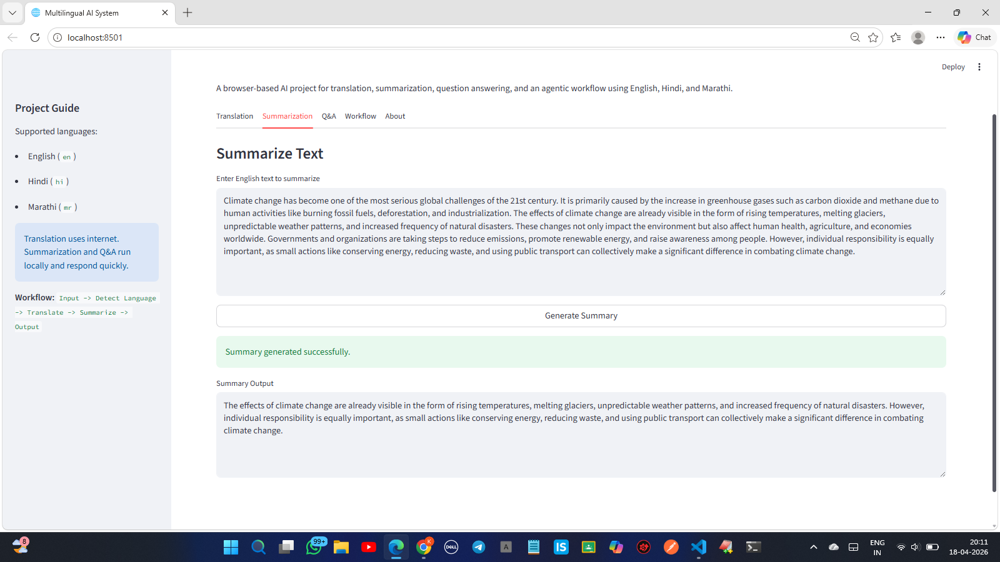
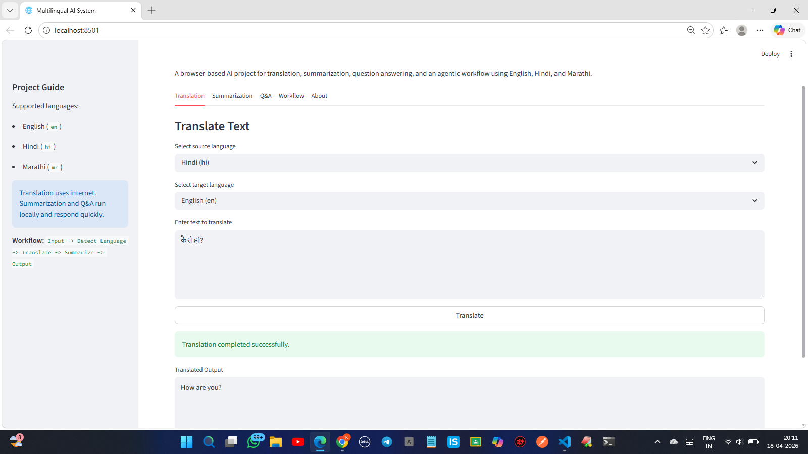
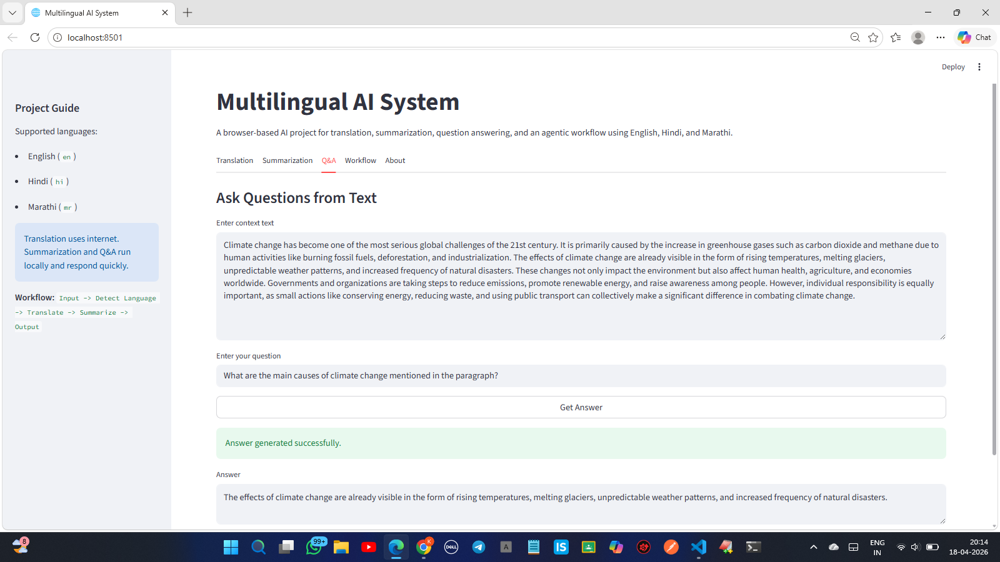
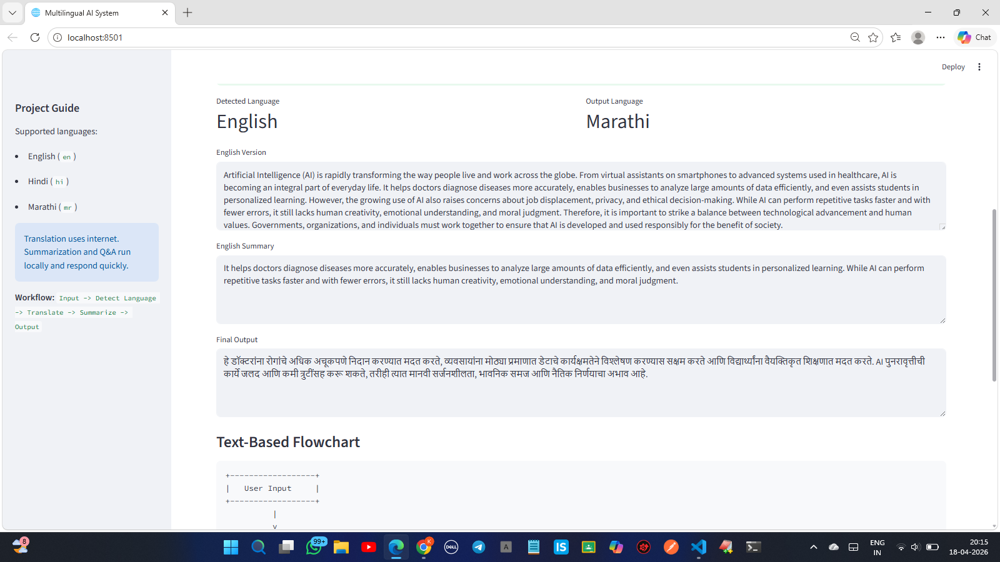
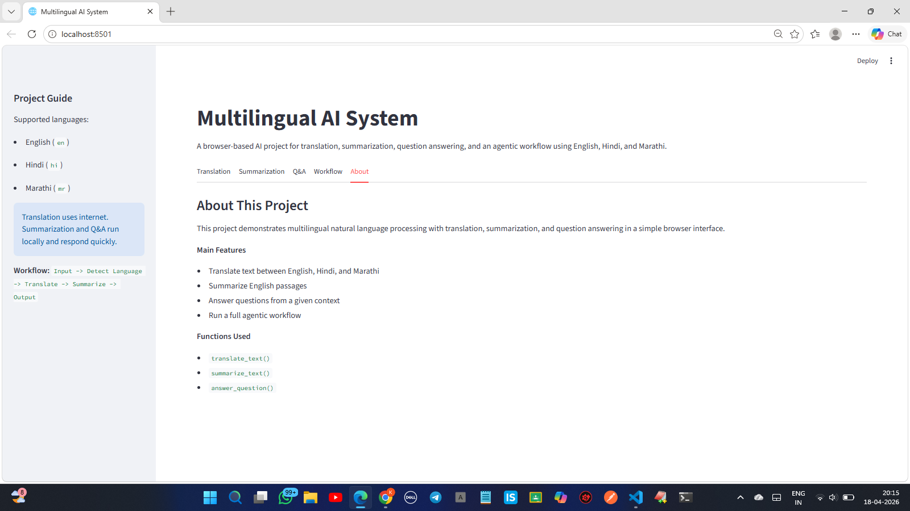

# Multilingual AI System with Translation, Summarization, and Q&A

## 1. Explanation of Project

This project is a beginner-friendly Python application built for academic learning. It demonstrates how Artificial Intelligence can be used to perform three useful Natural Language Processing tasks:

- Translation
- Summarization
- Question Answering (Q&A)

The project also follows an **agentic workflow**:

**Input -> Detect Language -> Translate -> Summarize -> Output**

The system is designed for multilingual support with a focus on:

- English
- Hindi
- Marathi

This makes the project suitable for students who want to understand how AI can process language step by step in a simple real-world application.

## 2. Features

- Translate text between English, Hindi, and Marathi
- Summarize long English text
- Answer questions based on a given passage
- Detect language automatically
- Run an agentic pipeline from input to final summarized output
- Browser-based web interface using Streamlit
- Beginner-friendly code with comments and functions
- Error handling for invalid or empty inputs

## 3. Prompt Design (All 5 Prompts)

### Prompt 1: Translation Prompt Basic

**Purpose:** Simple English to Hindi/Marathi translation

```text
Translate the following English sentence into {target_language}.
Keep the meaning simple, correct, and natural.
Sentence: {input_text}
```

### Prompt 2: Translation Prompt Optimized

**Purpose:** Better translation with tone and clarity

```text
You are a multilingual translation assistant.
Translate the following text from English into {target_language}.
Rules:
1. Preserve the original meaning.
2. Keep the tone natural and student-friendly.
3. Avoid word-for-word awkward translation.
4. Use clear grammar.
Text: {input_text}
```

### Prompt 3: Summarization Prompt Basic

**Purpose:** Short summary of paragraph

```text
Summarize the following text in 2-3 sentences.
Text: {input_text}
```

### Prompt 4: Summarization Prompt Optimized

**Purpose:** More focused summary

```text
You are an academic summarization assistant.
Read the text carefully and generate a concise summary.
Rules:
1. Keep only the main ideas.
2. Remove repetition and extra details.
3. Use simple language.
4. Limit the summary to 3 sentences.
Text: {input_text}
```

### Prompt 5: Q&A Prompt

**Purpose:** Answer questions using only the given context

```text
You are a question-answering assistant.
Answer the question using only the information provided in the context.
If the answer is not available in the context, say: "Answer not found in the given text."

Context: {context}
Question: {question}
```

## 4. Prompt Application

### Example Input

```text
Artificial Intelligence helps students learn faster by giving quick summaries, translations, and answers.
```

### Initial Output Using Basic Translation Prompt

**Hindi:** कृत्रिम बुद्धिमत्ता छात्रों को जल्दी सारांश, अनुवाद और उत्तर देकर तेजी से सीखने में मदद करती है।

### Improved Prompt

```text
You are a multilingual translation assistant.
Translate the following sentence from English into Hindi.
Preserve meaning, keep the tone natural, and make it easy for students to understand.
Sentence: Artificial Intelligence helps students learn faster by giving quick summaries, translations, and answers.
```

### Improved Output

**Hindi:** कृत्रिम बुद्धिमत्ता त्वरित सारांश, अनुवाद और उत्तर देकर छात्रों को अधिक तेजी और आसानी से सीखने में मदद करती है।

### Example Input for Summarization

```text
AI tools can help students by translating study material into local languages, summarizing long lessons, and answering their questions instantly. This improves learning speed and accessibility.
```

### Initial Output Using Basic Summarization Prompt

**Summary:** AI tools help students by translating, summarizing, and answering questions, which improves learning.

### Improved Prompt

```text
You are an academic summarization assistant.
Summarize the following text in 2 sentences.
Keep the most important ideas only and use simple language.
Text: AI tools can help students by translating study material into local languages, summarizing long lessons, and answering their questions instantly. This improves learning speed and accessibility.
```

### Improved Output

**Summary:** AI tools support students by translating content, summarizing lessons, and answering questions quickly. This makes learning faster and more accessible.

## 5. Translation Table (10 Examples)

| No. | English Sentence | Hindi Translation | Marathi Translation |
|---|---|---|---|
| 1 | Education is changing with the help of AI. | एआई की मदद से शिक्षा बदल रही है। | एआयच्या मदतीने शिक्षण बदलत आहे. |
| 2 | Students can learn faster using smart tools. | छात्र स्मार्ट टूल्स का उपयोग करके तेजी से सीख सकते हैं। | विद्यार्थी स्मार्ट साधनांचा वापर करून अधिक वेगाने शिकू शकतात. |
| 3 | Translation helps people understand different languages. | अनुवाद लोगों को अलग-अलग भाषाएं समझने में मदद करता है। | भाषांतर लोकांना वेगवेगळ्या भाषा समजण्यास मदत करते. |
| 4 | Summaries save time during exam preparation. | सारांश परीक्षा की तैयारी के दौरान समय बचाते हैं। | सारांश परीक्षेच्या तयारीदरम्यान वेळ वाचवतात. |
| 5 | Question answering systems improve learning support. | प्रश्नोत्तर प्रणालियां सीखने में सहायता को बेहतर बनाती हैं। | प्रश्नोत्तर प्रणाली शिक्षणातील मदत अधिक चांगली करतात. |
| 6 | Technology should be easy for beginners. | तकनीक शुरुआती लोगों के लिए आसान होनी चाहिए। | तंत्रज्ञान नवशिक्यांसाठी सोपे असले पाहिजे. |
| 7 | A good model gives accurate and clear output. | एक अच्छा मॉडल सटीक और स्पष्ट आउटपुट देता है। | एक चांगले मॉडेल अचूक आणि स्पष्ट आउटपुट देते. |
| 8 | Language detection is useful in multilingual systems. | बहुभाषी प्रणालियों में भाषा पहचान उपयोगी होती है। | बहुभाषिक प्रणालींमध्ये भाषा ओळख उपयुक्त ठरते. |
| 9 | AI can make education more accessible. | एआई शिक्षा को अधिक सुलभ बना सकता है। | एआय शिक्षण अधिक सुलभ करू शकते. |
| 10 | This project demonstrates a simple NLP pipeline. | यह परियोजना एक सरल एनएलपी पाइपलाइन को प्रदर्शित करती है। | हा प्रकल्प एक सोपी एनएलपी पाइपलाइन दाखवतो. |

## 6. Multilingual Content: Blog + Translations

### English Blog

Artificial Intelligence is becoming an important part of modern education. It helps students understand difficult topics through summaries, translations, and question-answering tools. With multilingual AI systems, learning becomes easier for students from different language backgrounds. Such technology can save time, improve understanding, and make education more inclusive.

### Hindi Translation

कृत्रिम बुद्धिमत्ता आधुनिक शिक्षा का एक महत्वपूर्ण हिस्सा बनती जा रही है। यह छात्रों को सारांश, अनुवाद और प्रश्नोत्तर उपकरणों के माध्यम से कठिन विषयों को समझने में मदद करती है। बहुभाषी एआई प्रणालियों के साथ, अलग-अलग भाषाई पृष्ठभूमि वाले छात्रों के लिए सीखना आसान हो जाता है। ऐसी तकनीक समय बचा सकती है, समझ को बेहतर बना सकती है और शिक्षा को अधिक समावेशी बना सकती है।

### Marathi Translation

कृत्रिम बुद्धिमत्ता आधुनिक शिक्षणाचा एक महत्त्वाचा भाग बनत आहे. ती विद्यार्थ्यांना सारांश, भाषांतर आणि प्रश्नोत्तर साधनांच्या मदतीने कठीण विषय समजून घेण्यास मदत करते. बहुभाषिक एआय प्रणालींमुळे विविध भाषिक पार्श्वभूमी असलेल्या विद्यार्थ्यांसाठी शिक्षण अधिक सोपे होते. अशा तंत्रज्ञानामुळे वेळ वाचू शकतो, समज वाढू शकते आणि शिक्षण अधिक सर्वसमावेशक होऊ शकते.

## 7. Workflow + Flowchart

### Agentic Workflow

1. User enters text.
2. System detects the input language.
3. If text is in Hindi or Marathi, the system translates it to English.
4. The English text is summarized.
5. The summary is translated to the final output language.
6. The result is displayed to the user.

### Text-Based Flowchart

```text
+------------------+
|   User Input     |
+------------------+
          |
          v
+------------------+
| Detect Language  |
+------------------+
          |
          v
+------------------------------+
| Translate to English if needed |
+------------------------------+
          |
          v
+------------------+
|  Summarize Text  |
+------------------+
          |
          v
+-----------------------------+
| Translate Summary to Output |
+-----------------------------+
          |
          v
+------------------+
| Final Output     |
+------------------+
```

## 8. Full Python Code

Code is available in [app.py](./app.py).

Main functions included:

- `translate_text()`
- `summarize_text()`
- `answer_question()`

## 9. Installation Steps

### Step 1: Create virtual environment (optional but recommended)

```bash
python -m venv venv
```

### Step 2: Activate virtual environment

**Windows**

```bash
venv\Scripts\activate
```

### Step 3: Install required libraries

```bash
pip install -r requirements.txt
```

## 10. How to Run

```bash
streamlit run app.py
```

After running the command, Streamlit will open the project in your browser. If it does not open automatically, copy the local URL shown in the terminal, usually:

```text
http://localhost:8501
```

## 11. Example Input/Output

### Example 1: Translation

**Input**

```text
Text: Education is changing with the help of AI.
Source language: en
Target language: hi
```

**Output**

```text
एआई की मदद से शिक्षा बदल रही है।
```

### Example 2: Summarization

**Input**

```text
AI tools can summarize long lessons, translate study material, and answer student questions quickly. This improves accessibility and saves time.
```

**Output**

```text
AI tools help by summarizing lessons, translating materials, and answering questions quickly. This saves time and improves accessibility.
```

### Example 3: Q&A

**Context**

```text
AI tools can summarize long chapters and answer questions instantly.
```

**Question**

```text
What can AI tools summarize?
```

**Output**

```text
long chapters
```

## 12. Screenshots

Add screenshots in this section after running the project:

- Screenshot 1: Home page in browser
- Screenshot 2: Translation output
- Screenshot 3: Summarization output
- Screenshot 4: Q&A output
- Screenshot 5: Agentic workflow output

You may create a folder named `screenshots/` and place images there.

## 13. File Structure

```text
Multilingual-AI-System/
│
├── app.py
├── requirements.txt
├── README.md
└── sample_input.txt
```

## 14. Future Scope

- Add more Indian languages such as Tamil, Telugu, and Bengali
- Improve the Streamlit interface with history and downloadable outputs
- Add speech-to-text and text-to-speech features
- Save translation and summary history
- Connect to cloud APIs for higher accuracy

## 15. Possible Viva Questions with Answers

### 1. What is the main objective of this project?

**Answer:** The main objective is to build a multilingual AI application that can translate text, summarize content, answer questions, and follow an agentic workflow.

### 2. What is NLP?

**Answer:** NLP stands for Natural Language Processing. It is a field of AI that helps computers understand and process human language.

### 3. Why is language detection used in this project?

**Answer:** Language detection helps the system identify whether the input text is in English, Hindi, or Marathi so that the correct translation step can be applied.

### 4. What is summarization?

**Answer:** Summarization is the process of reducing a long text into a shorter version while keeping the main meaning.

### 5. What is question answering in NLP?

**Answer:** Question answering is a task where the AI reads a given context and finds the answer to a user question from that context.

### 6. Why are functions used in this project?

**Answer:** Functions make the code organized, reusable, and easier to understand and test.

### 7. Which Python library is used in this project?

**Answer:** The main library used is `transformers`, and `langdetect` is used for language detection.

### 8. What is an agentic workflow?

**Answer:** An agentic workflow is a step-by-step intelligent process where the system performs multiple tasks in sequence to achieve a final goal.

### 9. Can this project work with more languages?

**Answer:** Yes, more languages can be added by using additional translation models.

### 10. What are the limitations of this project?

**Answer:** The project currently supports only a few languages, depends on model availability, and may take time to load models for the first run.

## 16. Notes

- The first run may take some time because transformer models need to download.
- Internet may be required once to download pretrained models.
- After download, models can be reused from local cache.

## 📸 Screenshots

### Output 1


### Output 2


### Output 3


### Output 4


### Output 5

